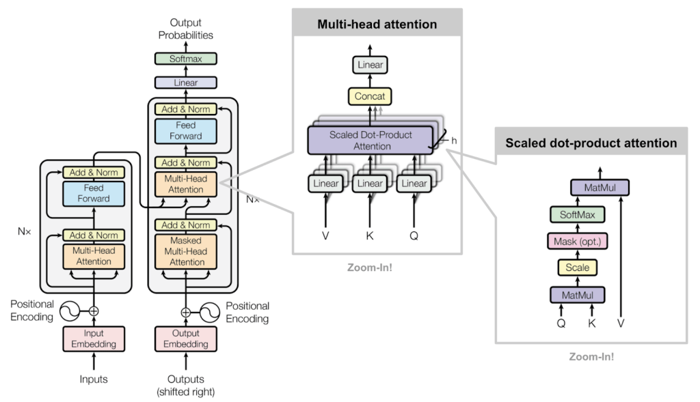

# Attention Mechanism
Attention mechanisms are a powerful technique in deep learning that allow models to focus on specific parts of the input data when making predictions. They have been widely used in various applications, including natural language processing and computer vision.

## Overview
Attention mechanisms work by assigning different weights to different parts of the input data, allowing the model to "attend" to the most relevant information. This is particularly useful in tasks where the input data is sequential or has a variable length, such as in language translation or image captioning.
## Key Concepts
- **Attention Weights**: These are the weights assigned to different parts of the input data, indicating their importance for the current prediction.
- **Context Vector**: This is a weighted sum of the input data, where the weights are the attention weights. It represents the most relevant information for the current prediction.
- **Self-Attention**: A mechanism where the model attends to different parts of the same input sequence, allowing it to capture dependencies within the sequence.

## Types of Attention Mechanisms
1. Scaled Dot-Product Attention
   - Computes attention weights using the dot product of queries and keys, scaled by the square root of the dimension of the keys.
2. Multi-Head Attention
   - Combines multiple attention mechanisms in parallel, allowing the model to focus on different parts of the input simultaneously.

3. Masked Multi-Head Attention
   - Applies a mask to the attention weights to prevent the model from attending to certain parts of the input, useful in tasks like language modeling.

(Source: [Attention Is All You Need](https://arxiv.org/abs/1706.03762))